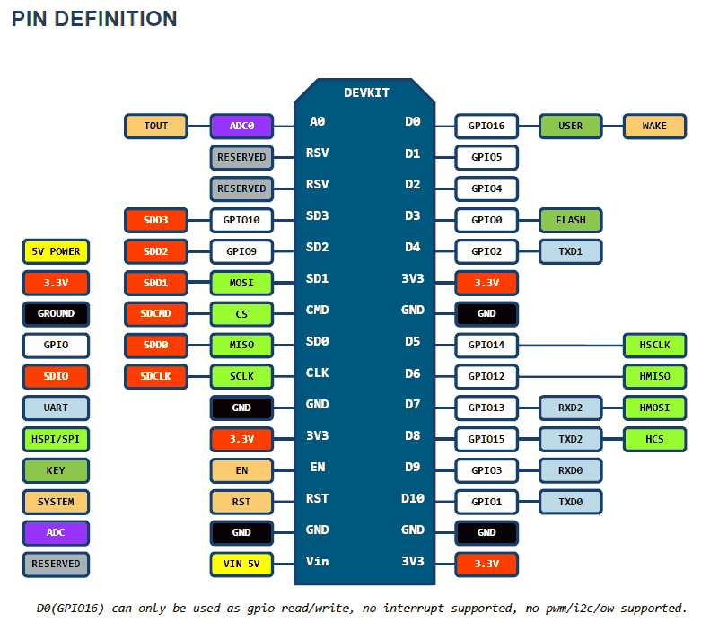

# ESP8266 Telemetry Sensor With WIFI, serveur Web, MQTT, InfluxDB, Grafana and Docker 

**Arduino IOT ----- In progress ------ Code en Beta pour le moment**

**Objectif du projet :**

Mettre en oeuvre une station météo locale avec différentes sondes environnementale 


The ghetto way to setup an IoT for your glorious Grafana Dashboard.

## Getting Started

These instructions will get you a copy of the project up and running on your local machine for development and testing purposes. See deployment for notes on how to deploy the project on a live system.

## Prerequisites

Composants techniques :

Acheté sur : https://www.banggood.com/fr/ESP8266-Weather-Station-Kit-with-Temperature-Humidity-Atmosphetic-Pressure-Light-Sensor-0_96-Display-for-Arduino-IDE-IoT-Starter-p-1751604.html?rmmds=myorder&cur_warehouse=CN


1. **ESP8266**
2. **SSD1306** Ecran OLED  
3. **BM180** Barometer Plage de pression: 300 ~ 1100hPa.
4. **DHT11** Temperature and Humidity sensor 
5. **BH1750FVI** : Digital Light Sensor - Capteur d'intensité lumineuse numérique Sortie numérique directe, calcul complexe omis, sans étalonnage
6. Proto board, scrap PCB, or wire to connect everything

Options 
 - 3.3V LDO regulator to supply your ESP

## Carte ESP8266 NodeMCU v3 LoLin




### Schéma de cablage 
Using ESP8266 NodeMCU v3 LoLin avec alimentation USB

To do : Faire un schéma avec l'un de ces logiciels
 - https://easyeda.com/
 - https://fritzing.org/
 - https://www.autodesk.com/products/eagle/overview

GPIO used on ESP8266 NodeMCU v3:
```
BMP180 I2C_SCL on D1 (ESP8266) or GPIO 5  
BMP180 I2C_SDA on D2 (ESP8266) or GPIO 4
DHT11 I/O on D6 or GPIO 12 (possibilité de le mettre sur le D5 aussi)
BH1750FVI I2C_SCL on D1 (ESP8266) or GPIO 5
BH1750FVI I2C_SDA on D2 (ESP8266) or GPIO 4
SSD1306 I2C_SCL on D4 (ESP8266)
SSD1306 I2C_SDA on D3 (ESP8266)

```


----------------------------------------------------------------- END PAD ------------------------------------------


```


There are further Services that can be switched on:

* **Tor** (Run as Hidden Service) [details](htt


### Place Holder

Using two different sensor to get a single data.


### Flashing ESP8266

Place Holder
```
Place Holder
```

Place Holder

## MQTT Broker
### Manual Install
Install Mosquitto to your ubuntu server.
```
sudo apt-get update
sudo apt install mosquitto mosquitto-clients
```

Configure your /etc/mosquitto/mosquitto.conf
```
# /etc/mosquitto/mosquitto.conf

pid_file /var/run/mosquitto.pid
log_dest file /var/log/mosquitto/mosquitto.log
include_dir /etc/mosquitto/conf.d
persistence true
persistence_location /var/lib/mosquitto/
allow_anonymous false
password_file /etc/mosquitto/passwd
```

Create a password file for your MQTT broker by running this command.

```
sudo mosquitto_passwd -c /etc/mosquitto/passwd someguy
```
After that don't forget to restart Mosquitto.
```
sudo systemctl restart mosquitto
```

### Auto Install
```
Place Holder
```
### Check your MQTT Broker
Before we continue we could try to check if our broker receive the payload from our ESP. 
Run this command on our broker server to see the payload. If there's no results, check your connection and your configuration on both devices.
```
mosquitto_sub -h localhost -t test -u "someguy" -P "SuperSekritPassword"
```


## InfluxDB

### Install InfluxDB 1.8.x and Telegraf on your server. 
```
https://portal.influxdata.com/downloads/
```
Open your influxDB configuration at `/etc/influxdb/influxdb.conf` if you're using Ubuntu, and change some parameters as below.
```
 [http]
  # Determines whether HTTP endpoint is enabled.
  enabled = true

  # Determines whether the Flux query endpoint is enabled.
  flux-enabled = true

  # The bind address used by the HTTP service.
  bind-address = ":8086"

```
Dont forget to save and restart your influxdb service.
```
 sudo systemctl restart influxdb
```

To setup an authentication for your InfluxDB service, we need to make an  administrator account. 
```
user@host:~$ influx
Connected to http://localhost:8086 version 1.8.0
InfluxDB shell version: 1.8.0
> CREATE USER admin WITH PASSWORD 'SuperSekritPassword' WITH ALL PRIVILEGES
> SHOW USERS
user  admin
----  -----
admin true
```
And then head over again to influxdb.conf and change this parameter.
```
  # Determines whether user authentication is enabled over HTTP/HTTPS.
  auth-enabled = true
```
Now you could restart your InfluxDB again.
We can test the authentication by using this command : 
```
curl -G http://localhost:8086/query -u admin:SuperSekritPassword --data-urlencode "q=SHOW DATABASES"
```
If it give us a result then we're successful on setting up our InfluxDB. 
Now its time to setup our Telegraf service. After you finish installing Telegraf, open Telegraf configuration at `/etc/telegraf/telegraf.conf` if you're using ubuntu. You could use your InfluxDB user and password for Telegraf or make another influxDB user dedicated for Telegraf.
```
## HTTP Basic Auth
  username = "admin"
  password = "SuperSekritPassword"
```
After this you could save the config and restart your Telegraf service.
```
sudo systemctl restart telegraf
```
### MQTT to Telegraf
After setting up everything, now we need to make MQTT to work together with InfluxDB by using Telegraf [MQTT Consumer plugin](https://github.com/influxdata/telegraf/tree/master/plugins/inputs/mqtt_consumer).

Open your Telegraf configuration file `/etc/telegraf/telegraf.conf`, and search for input plugins and add the [MQTT Consumer plugin](https://github.com/influxdata/telegraf/tree/master/plugins/inputs/mqtt_consumer).

Change the servers to our MQTT server IP addresses and port, add our test topic to sub,  change the username and password to our MQTT user and pass, and data_format to json.
```
[[inputs.mqtt_consumer]]
  servers = ["tcp://127.0.0.1:1883"] 
  topics = [
    "telegraf/host01/cpu",
    "telegraf/+/mem",
    "sensors/#",
    "test",
  ]
  username = "admin"
  password = "SuperSekritPassword"
  data_format = "json"
```
Save the config and restart Telegraf service.

## Grafana

Please read [Place Holder](https://place-holder) for Place Holder.


## Authors

* **Place Holder** - *Place Holder* - [Place Holder](https://place-holder)

Place Holder


## Acknowledgments

* Ayylmao

